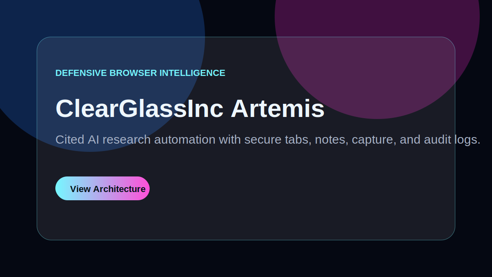
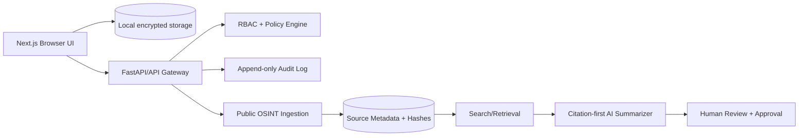

# ClearGlassInc Artemis Browser Intelligence Assistant

ClearGlassInc Artemis is an open-source, lawful defensive browser intelligence and research assistant for security teams that need high-assurance source tracking, AI-assisted synthesis, and audited workflows. It is designed for **browser security**, **AI research automation**, and **cybersecurity workflow automation** without offensive, deceptive, or unauthorized-access features.



## Use Cases

- Defensive vulnerability and vendor-advisory research with citation-preserving notes.
- Public-source OSINT collection from HTTPS public websites, government portals, academic pages, public datasets, and vendor advisories.
- Browser tab investigations where every capture is hashed, timestamped, and linked to analyst notes.
- AI summarization that rejects uncited claims and preserves evidence snippets for review.
- Security-team collaboration with role-based permissions, append-only audit logs, and human approval gates.

## What Is Included

- **Next.js landing app** with a glass/neon premium interface and SEO metadata in `apps/web`.
- **Python security core** for local-first browser workflow models, public-source validation, RBAC, audit sealing, cited summaries, and encrypted secret envelopes.
- **Tests and CI** covering the browser assistant primitives and building the web application.
- **Hardening guidance** for CSP, zero-trust access, local secret handling, auditability, and safe AI usage.

## Architecture



### Secure Browser Workflow

1. Open mission-scoped research tabs.
2. Capture only public HTTPS sources.
3. Store source metadata, short excerpts, timestamps, and SHA-256 content hashes.
4. Attach notes to source URLs.
5. Generate AI summaries only when every sentence has citations.
6. Seal every read/write/capture/secret action into an audit event.

### Data Model Highlights

- `ResearchSource`: public HTTPS URL, source title, source kind, capture timestamp, content hash, license note.
- `BrowserTab`: tab ID, active URL, title, attached source records.
- `ResearchNote`: note body, source URLs, author, timestamp.
- `AISummary`: summary text plus citation list; validation enforces citations for every claim.
- `AuditEvent`: actor, action, target, allow/deny reason, timestamp, tamper-evident hash.
- `LocalFirstVault`: encrypted envelope interface for local secrets with authenticated ciphertext.

## Threat Model

| Asset | Threat | Control |
| --- | --- | --- |
| Analyst notes | Unauthorized reads/writes | RBAC, mission scoping, local encryption |
| Secrets | Token leakage | Encrypted envelopes, no plaintext persistence, KMS/keychain-ready interface |
| Source integrity | Tampered evidence | SHA-256 hashes, timestamps, source URLs, append-only audit |
| AI output | Hallucinated claims | Citation-per-claim validation and human review |
| Browser UI | XSS/clickjacking | CSP, `X-Frame-Options: DENY`, `nosniff`, restricted permissions policy |
| Governance | Unapproved consequential actions | Approval gates, audit logs, policy-as-code |

## Security and Governance

- Public-source-only ingestion; private/local URLs are rejected by validation.
- No exploit modules, credential collection, phishing, persistence, evasion, scanning, or unauthorized access logic.
- Least-privilege roles: viewer, researcher, auditor, and admin.
- Human approval gates for operationally significant actions.
- Immutable audit hashes for accountability and non-repudiation.
- Recommended production secret backend: OS keychain, WebCrypto, KMS/HSM-wrapped keys, or libsodium.

## Setup

### Python core

```bash
python -m pip install -e '.[dev]'
pytest tests/test_browser_research_assistant.py
```

### Next.js web app

```bash
cd apps/web
npm install
npm run dev
```

### Production build

```bash
cd apps/web
npm run build
```

## CI

GitHub Actions run Python tests and the Next.js production build in `.github/workflows/browser-intelligence-ci.yml`.

## Screenshots

The landing page is implemented in `apps/web/app/page.tsx`. Add real screenshots under `docs/screenshots/` after deploying or running the app locally.

## Roadmap

- Browser extension companion with WebCrypto-backed IndexedDB storage.
- Pluggable public-source connectors for CVE, CISA KEV, NVD, vendor advisories, and public RSS feeds.
- Signed append-only audit log export.
- OPA/Rego policy-as-code integration.
- Offline embedding index for local retrieval.
- Evals dashboard for citation coverage, precision, recall, latency, and analyst trust.
- Optional enterprise SSO and SCIM provisioning.

## ClearGlassInc Artemis 2040 Architecture

For the broader self-evolving intelligence platform design using Palantir Gotham, Foundry, AIP, and Apollo, see [`artemis-blueprint.md`](./artemis-blueprint.md) and the architecture documents in [`docs/`](./docs/).

---

© 2026 ClearGlass Inc. Defensive research use only.
