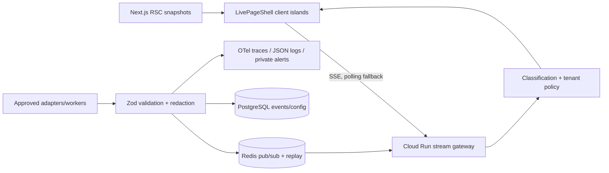

# ClearGlass Live Signal Fabric

## Existing-system inspection (2026-08-08)

The repository currently ships a Next.js 16.3 (not 15) App Router application on React 19 and Node, with strict TypeScript and standalone output. Routes are `/`, `/legal`, and middleware-protected API routes added by this migration. The landing page was a single large Client Component with local hard-coded illustrative command-console arrays; there was no network data fetching, API route, analytics SDK, loading boundary, error boundary, or configured live provider. Deployment is CI/static documentation plus a standalone Node build suitable for Cloud Run. The only environment template belonged to the Python API. External links point to ClearGlassInc; no data connector existed. Middleware already supplied CSP, HSTS, frame denial, MIME sniffing prevention, referrer, permissions, COOP, and CORP headers. Design tokens are near-black, cyan, lime, red, violet glass surfaces with reduced-motion CSS. Primary bottlenecks are a page-wide Client Component, extensive atmospheric CSS, and monolithic rendering. Existing metric, signal, agent, graph, and audit panels are suitable for later source-backed updates, but their present values are illustrative—not live.

## Phased migration

1. **Foundation (implemented):** validated envelope, adapter contract, server snapshot, fail-closed SSE, page shell, fallback states, environment template, retention schema.
2. **Public status:** approve and implement a health-provider adapter, Redis replay buffer, distributed quotas, signed ingestion, and public status cards.
3. **Page modules:** split the page into RSC sections and subscribe only visible status/performance/content modules.
4. **Authenticated dashboards:** integrate the identity provider, workspace claims, PostgreSQL RLS, tenant-filtered Redis channels, and two-person approvals.
5. **Analytics:** consented Web Vitals and aggregate funnels with minimum cohort thresholds and evaluation dashboards.
6. **Hardening:** load/chaos tests, privacy review, alerts, backup restore exercise, SLOs, owner activation, and gradual rollout.

## Architecture

Public streams are `public`, `status`, `performance`, and `content`; `dashboard` is protected and currently returns 401. No WebSocket is introduced. The web service can host low-volume SSE initially; split the gateway before production scale.

## Taxonomy, classification, and authorization

Events use `<domain>.<verb>`: `status.updated`, `performance.measured`, `content.published`, `deployment.completed`, `incident.opened`, and authenticated `growth.aggregated`. Payloads are minimal, source-attributed, versioned, ordered, and expire after their configured retention.

| Class | Browser audience | Examples |
|---|---|---|
| PUBLIC | Anonymous | Aggregate availability, approved incident notice |
| AUTHENTICATED | Signed-in user | Own profile-safe notices |
| WORKSPACE | Tenant member | Aggregate project metrics |
| ADMIN | Workspace/platform admin | Configuration and approvals |
| INTERNAL | Operators only | Source health and queue telemetry |
| SECRET | Never serialized to public browser | Credentials, raw findings, private payloads |

| Role | Public | Authenticated | Workspace | Admin | Internal |
|---|---:|---:|---:|---:|---:|
| Anonymous visitor | yes | no | no | no | no |
| Authenticated user | yes | yes | no | no | no |
| Workspace member | yes | yes | own tenant | no | no |
| Workspace administrator | yes | yes | own tenant | own tenant | no |
| Billing administrator | yes | yes | billing subset | no | no |
| Platform administrator | yes | yes | support grant only | yes | no |
| Internal operator | yes | duty-scoped | duty-scoped | duty-scoped | yes |

## Security and AI boundary

Threats include forged sources, replay, oversized events, connection exhaustion, cross-tenant reads, prompt injection, payload leakage, and stale status presented as live. Controls are Zod schemas, a source allowlist, timestamp/sequence checks, durable uniqueness, server-side classification, origin checks, protected-stream fail-closed authorization, payload limits/quotas (to be distributed through Redis), redacted structured logs, CSP, and explicit freshness. External text is untrusted data, never instructions. AI receives a frozen authorized snapshot with timestamp and provenance; tools require policy checks and human approval; prompt/model/workflow changes progress through `DRAFT`, `REVIEW_REQUIRED`, `APPROVED`, `REJECTED`, `EXPIRED`, `PUBLISHED`, with immutable audit and Apollo rollback. No AI connector is active.

## Performance and observability budget

Limits: 3 public connections/IP, 5/user, 4 streams/page, 10 events/s/client, 16 KiB/event, 30-second retry ceiling, 10 DOM batches/s, 30 FPS optional visuals, and 35 KiB gzip incremental live JS. Pause hidden/offscreen nonessential streams and poll no faster than 30 seconds. Private dashboards should chart active connections, failures, reconnects, delivery latency, validation failures, drops, stale duration, source health, queue depth, CPU/memory, API/render latency, and disconnect/error rate. Alert on schema spikes, authorization failures, backlog, source outage, stale public status, unusual subscriptions, and browser resource excess. Emit OpenTelemetry spans and JSON metadata only—never payloads.

## Deployment, rollback, and approvals

1. Provision Cloud SQL PostgreSQL, Memorystore Redis, Secret Manager, private networking, and separate `web`/`stream-gateway` Cloud Run services.
2. Run `psql "$LIVE_DATABASE_URL" -f db/migrations/001_live_signal_fabric.sql`.
3. Build with `cd apps/web && npm ci && npm run build`; deploy a revision with min instances and concurrency derived from load tests.
4. Configure health/readiness probes, log routing, alerts, PITR backups, budgets, max instances, and graceful SIGTERM draining.
5. Keep `LIVE_PUBLIC_ENABLED=false` and traffic at zero until credentials, scopes, classifications, privacy notice, quotas, monitoring, failure tests, and owner approval are recorded.
6. Roll back with `gcloud run services update-traffic WEB_SERVICE --region REGION --to-revisions PREVIOUS_REVISION=100`; disable streams immediately by setting the flag false. Restore database only through the documented PITR runbook.

Production readiness requires source-owner authorization, privacy/legal classification approval, security review, tenant-isolation test evidence, accessibility and load budgets, monitoring ownership, backup restore proof, incident exercise, and product-owner activation. The development adapter is intentionally unavailable and generates no fake events. No real data source is connected yet.
