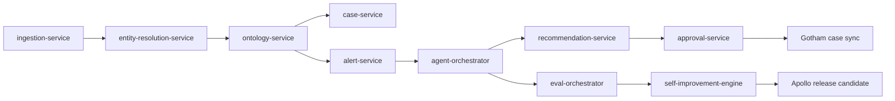

# ClearGlassInc Artemis — Self-Evolving Intelligence Platform

This blueprint defines a production-grade, secure, coalition-aware intelligence platform that combines:
- **Palantir Foundry** for data integration, ontology, and pipeline governance.
- **Palantir Gotham** for operations, investigations, entity-centric casework.
- **Palantir AIP** for copilots, tool-using agents, evaluation harnesses, and workflow automation.
- **Palantir Apollo** for controlled, enclave-aware deployments, canarying, rollback, and runtime policy promotion.

---

## System Architecture

### 1.1 End-to-End Reference Architecture

```text
[Sensors/Feeds/OSINT/SIGINT/HUMINT/Partner APIs/Bulk Archives]
                               |
                               v
                    [Ingestion + Mediation Layer]
          (stream adapters, schema contracts, DLP pre-filters)
                               |
                               v
                [Foundry Data Plane + Ontology Layer]
     (Bronze/Silver/Gold datasets, transforms, lineage, ACL semantics)
                               |
                               v
             [AIP Orchestration + Agent Runtime + Eval Harness]
      (copilots, tool registry, workflow DAGs, routing, policy gates)
                               |
                               v
            [Gotham Operations Apps + Investigations + Cases]
     (entity graph, watchlists, mission timelines, adjudication queues)
                               |
                               v
        [API Gateway + Mission Services + Real-time Event Backbone]
    (FastAPI, Kafka/NATS, graph retrieval, state machines, notification)
                               |
                               v
          [Web UI / Command UI / Analyst Workbench / Edge Mobile]
                               |
                               v
                   [Apollo Deployment Control Plane]
         (canary, promotion, rollback, enclave-specific releases)
```

### 1.2 Runtime Subsystems and Responsibilities

| Layer | Core Responsibilities | Tech Choices |
|---|---|---|
| Mission UX | Analyst copilot chat, triage boards, graph explorer, timeline replay, approval queues | React, TypeScript, WebSocket/SSE |
| API Gateway | mTLS edge termination, JWT validation, ABAC pre-check, throttling, request signing | FastAPI, Envoy, OPA sidecar |
| Mission Services | case mgmt, entity mgmt, intel products, action packages, eval orchestration | Python 3.12, FastAPI, pydantic |
| Event Backbone | async workflows, alert fanout, outbox pattern, SLA telemetry | Kafka + schema registry |
| Foundry Data Plane | ingestion, normalization, entity resolution, feature derivation, governance | Foundry pipelines + ontology |
| AIP Orchestration | copilots, tool calls, multi-agent DAG execution, eval runner | AIP runtime, Python tool adapters |
| Gotham Ops Plane | investigations, mission package execution, operator adjudication | Gotham operational apps |
| Deployment Plane | signed artifacts, staged rollout, instant rollback, config promotion | Apollo |

### 1.3 Service Topology (Backend)



---

### 1) Learning signal capture

### 2.1 Ontology Object Model (Foundry Object Types)

#### Primary entity types
- `Person`
- `Organization`
- `Asset`
- `Device`
- `Location`
- `Event`
- `Signal`
- `Case`
- `Mission`
- `IntelReport`
- `Recommendation`
- `ActionPackage`

#### Example schema (`Person`)

```yaml
object_type: Person
primary_key: person_id
fields:
  person_id: string
  name: string
  aliases: string[]
  nationality: string
  risk_score: float
  confidence_score: float
  first_seen: timestamp
  last_seen: timestamp
  mission_ids: string[]
  classification_level: string
  releasability_tags: string[]
  compartment_tags: string[]
  provenance_refs: string[]
  lineage_id: string
  observed_time: timestamp
  ingested_time: timestamp
  valid_time_start: timestamp
  valid_time_end: timestamp|null
```

### 2.2 Relationship Types

- `ASSOCIATED_WITH(Person, Organization)`
- `OWNS(Organization, Asset)`
- `LOCATED_AT(Person|Asset, Location)` *(temporal edge)*
- `MENTIONED_IN(Entity, IntelReport)`
- `TRIGGERED(Event, Alert)`
- `RECOMMENDS(Recommendation, ActionPackage)`
- `APPROVED_BY(ActionPackage, Operator)`

Each edge includes:
- `confidence_score`
- `evidence_refs[]`
- `lineage_id`
- `valid_time_start`, `valid_time_end`
- `classification`, `releasability`

### 2.3 Time + Lineage + Explainability Contract

Every object and edge is bitemporal:
- **valid time** = when fact was true in world.
- **transaction/ingest time** = when platform learned/stored it.

This supports:
- `as_of_time` replay (“what did we know at 14:30Z?”)
- reproducible investigation snapshots
- explainable recommendations backed by specific source fragments

### 2.4 Permission Semantics (Need-to-Know + Coalition)

- **Row/entity-level**: mission assignment + clearance + coalition tag.
- **Column-level**: selective redaction of sensitive fields.
- **Edge-level**: hidden cross-compartment links if not releasable.
- **Dynamic ABAC context**: role, mission, jurisdiction, legal basis, releasability.

---

### 3) Event + storage + retrieval

### 3.1 Copilot Roles

1. **Analyst Copilot**
   - Entity history synthesis
   - Hypothesis generation with confidence intervals
   - Source-grounded evidence trails

2. **Commander Copilot**
   - Mission-level risk deltas
   - COA (course-of-action) comparison with policy constraints
   - Time-to-impact estimation

3. **Watchfloor Copilot**
   - Live triage support
   - Duplicate suppression hints
   - Confidence calibration guidance

### 3.2 Multi-Agent Workflow (AIP DAG)

```text
TRIAGE -> ENRICH -> CORRELATE -> SUMMARIZE -> RECOMMEND -> POLICY_GATE -> HUMAN_REVIEW -> CLOSE
```

- **Triage Agent**: novelty/severity scoring + de-dup fingerprint.
- **Enrichment Agent**: ontology neighborhood expansion + historical context.
- **Correlation Agent**: temporal motifs + graph pattern detection.
- **Summarization Agent**: structured intel brief generation.
- **Recommendation Agent**: action package proposal drafting.
- **Policy Gate Agent**: governance pre-checks + auto-redaction.
- **Human Approval Node**: mandatory for operationally significant actions.

### 3.3 Tool-Using Agent Capabilities

Allowed tools (scoped + policy-mediated):
- Foundry dataset/object query
- Graph traversal with bounded depth/cardinality
- Gotham case open/update actions
- Intel product template drafting
- Action package preparation *(non-executing until human approval)*

---

## 4) Self-Improvement Loop (Safe + Versioned + Audited)

### 4.1 Captured Learning Signals

- operator edit distance on AI drafts
- accept/reject outcomes for recommendations
- case closure outcomes and ground-truth labels
- alert false-positive / false-negative adjudications
- latency, token usage, model route metadata
- policy violation counters and block reasons
- trust metrics (acceptance, override, rework)

### 1) FastAPI gateway with policy check

```text
Runtime Logs
  -> Feature Extraction
  -> Eval Dataset Builder
  -> Candidate Generator (prompt/workflow/router/calibration)
  -> Offline Replay + Policy Tests
  -> Human Review Board
  -> Apollo Canary
  -> Drift/Quality Monitoring
  -> Promote or Rollback
```

### 4.3 Allowed vs Blocked Self-Modification

**Allowed (guardrailed):**
- prompt template revisions within schema bounds
- workflow tool ordering changes
- model routing threshold tuning
- confidence calibration heuristics

**Blocked without explicit engineering + governance change:**
- mission objective mutation
- bypassing policy gate logic
- autonomous operational execution
- classification/releasability relaxation

### 4.4 Versioning and Rollback Model

- `prompt_version`
- `workflow_version`
- `router_policy_version`
- `policy_bundle_version`

All change proposals are immutable artifacts with:
- artifact hash
- proposer identity
- eval report ID
- approval signatures

Rollback triggers:
- precision drop > configured threshold
- p95 latency SLO breach
- trust score degradation
- any policy violation in canary

---

async def opa_allow(subject: dict, action: str, resource: dict) -> bool:
    payload = {"input": {"subject": subject, "action": action, "resource": resource}}
    async with httpx.AsyncClient(timeout=2.0) as client:
        r = await client.post("http://opa:8181/v1/data/artemis/allow", json=payload)
        r.raise_for_status()
        return bool(r.json().get("result", False))

### 5.1 Web UI (TypeScript/React)

Screens:
- Mission dashboard
- Alert stream + triage queue
- Graph explorer + temporal timeline
- Copilot panel with “Why this?” provenance tab
- Recommendation approval/reject/revise workflow

Client architecture:
- `app-shell`
- `mission-state` (Redux Toolkit / Zustand)
- `live-stream` (SSE/WebSocket)
- `auth-context` (OIDC + mission claims)
- `policy-aware components` (hide/redact by ABAC decision)

### 5.2 API Gateway + Mission Services (Python/FastAPI)

Core APIs:
- `POST /api/alerts/ingest`
- `GET /api/entities/{id}`
- `POST /api/copilot/query`
- `POST /api/actions/propose`
- `POST /api/actions/{id}/approve`
- `POST /api/actions/{id}/reject`
- `POST /api/evals/run`

Request context includes signed claims:
- `mission_ids`
- `clearance`
- `coalition`
- `roles`
- `compartments`

### 5.3 Event Backbone

Kafka topics:
- `intel.raw.events`
- `intel.normalized.events`
- `intel.enriched.events`
- `agent.recommendations`
- `operator.feedback`
- `eval.outcomes`
- `policy.decisions`

### 5.4 Retrieval + Search

Hybrid retrieval stack:
1. structured ontology query (high precision)
2. vector retrieval over reports/chunks
3. graph neighborhood expansion
4. rerank by confidence + recency + mission relevance

### 5.5 Model Router

Policy-aware routing examples:
- low-latency model for triage
- high-reasoning model for mission synthesis
- deterministic constrained output model for regulated artifacts

### 5.6 Observability + Evals

- OpenTelemetry traces with request/mission IDs
- model/tool call spans
- audit log append-only stream
- eval dashboards per mission/team/model route
- drift monitoring (input distribution + performance drift)

---

### 3) Ontology-aware query function

```python
from sqlalchemy import text

def fetch_case_graph(conn, case_id: str, max_depth: int = 2):
    sql = text("""
    WITH RECURSIVE g AS (
      SELECT e.entity_id, e.entity_type, e.canonical_name, 0 AS depth
      FROM ontology_entity e
      JOIN case_entity ce ON ce.entity_id = e.entity_id
      WHERE ce.case_id = :case_id
      UNION ALL
      SELECT e2.entity_id, e2.entity_type, e2.canonical_name, g.depth + 1
      FROM g
      JOIN ontology_relationship r ON r.src_entity_id = g.entity_id
      JOIN ontology_entity e2 ON e2.entity_id = r.dst_entity_id
      WHERE g.depth < :max_depth
    )
    SELECT * FROM g;
    """)
    return conn.execute(sql, {"case_id": case_id, "max_depth": max_depth}).mappings().all()
```

- **Zero Trust**: all calls authenticated/authorized; no network-location trust.
- **Need-to-know default deny**.
- **Compartment + coalition enforcement** at row/column/edge/action levels.
- **Policy-as-code** in gateway and tool runtime.
- **Prompt governance**: versioned prompts, test reports, approval signatures.
- **Model governance**: approved registry, intended-use constraints, fallback paths.
- **Immutable provenance**: append-only logs for data access, outputs, approvals, upgrades.

---

## 7) Code Examples (Python-First, Production-Oriented)

### 7.1 FastAPI Gateway + Policy Context

```python
# artemis/backend/app.py
from fastapi import FastAPI, Depends, HTTPException
from pydantic import BaseModel, Field
from typing import Any

from .security import auth_context, enforce_policy
from .services.copilot import run_copilot_query
from .services.actions import propose_action, approve_action

app = FastAPI(title="ClearGlassInc Artemis API", version="1.0.0")


class CopilotRequest(BaseModel):
    mission_id: str
    query: str = Field(min_length=3, max_length=4096)
    context_filters: dict[str, Any] = {}


@app.post("/api/copilot/query")
async def copilot_query(req: CopilotRequest, ctx=Depends(auth_context)):
    enforce_policy(ctx, action="copilot:query", mission_id=req.mission_id)
    return await run_copilot_query(req, ctx)


@app.post("/api/actions/propose")
async def actions_propose(req: CopilotRequest, ctx=Depends(auth_context)):
    enforce_policy(ctx, action="action:propose", mission_id=req.mission_id)
    return await propose_action(req, ctx)


@app.post("/api/actions/{action_id}/approve")
async def actions_approve(action_id: str, mission_id: str, ctx=Depends(auth_context)):
    enforce_policy(ctx, action="action:approve", mission_id=mission_id)
    result = await approve_action(action_id, mission_id, ctx)
    if not result["ok"]:
        raise HTTPException(status_code=409, detail=result["reason"])
    return result
```

### 7.2 Policy-as-Code Guard (ABAC)

```python
# artemis/policy/guard.py
class PolicyError(Exception):
    pass


def enforce_policy(ctx, action: str, mission_id: str) -> None:
    if mission_id not in ctx.assigned_missions:
        raise PolicyError("Mission access denied")

    if action.startswith("action:") and "OPS_APPROVER" not in ctx.roles:
        raise PolicyError("Insufficient role for operational action")

    if ctx.coalition not in ctx.allowed_coalitions:
        raise PolicyError("Coalition boundary violation")

    if ctx.clearance_rank < ctx.mission_clearance_floor.get(mission_id, 0):
        raise PolicyError("Clearance below mission floor")
```

### 7.3 Agent Workflow State Machine

```python
# artemis/agents/orchestrator.py
from enum import StrEnum


class State(StrEnum):
    TRIAGE = "triage"
    ENRICH = "enrich"
    CORRELATE = "correlate"
    SUMMARIZE = "summarize"
    RECOMMEND = "recommend"
    POLICY_GATE = "policy_gate"
    HUMAN_REVIEW = "human_review"
    DONE = "done"


async def run_workflow(event: dict, tools, models) -> dict:
    state = State.TRIAGE
    ctx = {"event": event, "trace": [], "versions": {}}

    while state != State.DONE:
        if state == State.TRIAGE:
            ctx["triage"] = await models.triage.classify(event)
            state = State.ENRICH

        elif state == State.ENRICH:
            ids = event.get("entity_ids", [])
            ctx["enrichment"] = await tools.ontology.enrich(ids)
            state = State.CORRELATE

        elif state == State.CORRELATE:
            ctx["correlation"] = await tools.graph.correlate(ctx)
            state = State.SUMMARIZE

        elif state == State.SUMMARIZE:
            ctx["summary"] = await models.summarizer.generate(ctx)
            state = State.RECOMMEND

        elif state == State.RECOMMEND:
            ctx["recommendation"] = await models.recommender.propose(ctx)
            state = State.POLICY_GATE

        elif state == State.POLICY_GATE:
            policy_result = await tools.policy.validate(ctx["recommendation"])
            ctx["policy_result"] = policy_result
            state = State.HUMAN_REVIEW if policy_result["allow"] else State.DONE

        elif state == State.HUMAN_REVIEW:
            ctx["status"] = "pending_operator_approval"
            state = State.DONE

    return ctx
```

### 7.4 Ontology-Driven Query (SQL)

```sql
-- Find high-risk entities relevant to mission in last 24h
SELECT
    e.entity_id,
    e.entity_type,
    e.risk_score,
    r.relationship_type,
    ev.event_time,
    e.confidence_score
FROM ontology_entities e
JOIN ontology_relationships r
    ON r.src_entity_id = e.entity_id
JOIN mission_events ev
    ON ev.entity_id = e.entity_id
WHERE ev.mission_id = :mission_id
  AND ev.event_time >= NOW() - INTERVAL '24 hours'
  AND e.risk_score >= 0.75
  AND e.visibility_label <= :user_clearance
ORDER BY e.risk_score DESC, e.confidence_score DESC;
```

### 7.5 Event Consumer + Recommendation Emission

```python
# artemis/backend/event_handlers.py
import asyncio
from aiokafka import AIOKafkaConsumer, AIOKafkaProducer


async def consume_and_recommend(orchestrator):
    consumer = AIOKafkaConsumer(
        "intel.enriched.events",
        bootstrap_servers="kafka:9092",
        group_id="artemis-orchestrator",
    )
    producer = AIOKafkaProducer(bootstrap_servers="kafka:9092")

    await consumer.start()
    await producer.start()
    try:
        async for msg in consumer:
            event = msg.value
            result = await orchestrator.run(event)
            if "recommendation" in result:
                await producer.send_and_wait("agent.recommendations", result)
    finally:
        await consumer.stop()
        await producer.stop()


if __name__ == "__main__":
    asyncio.run(consume_and_recommend(orchestrator=...))
```

### 7.6 Feedback -> Eval Dataset Builder

```python
# artemis/evals/pipeline.py
def build_eval_rows(interactions: list[dict], outcomes: dict) -> list[dict]:
    rows: list[dict] = []
    for it in interactions:
        outcome = outcomes.get(it["case_id"])
        rows.append(
            {
                "prompt_version": it["prompt_version"],
                "workflow_version": it["workflow_version"],
                "router_policy_version": it["router_policy_version"],
                "model_route": it["model_route"],
                "operator_edit_distance": it["edit_distance"],
                "approved": it["approved"],
                "mission_success": outcome["mission_success"] if outcome else None,
                "latency_ms": it["latency_ms"],
                "policy_violations": it["policy_violations"],
            }
        )
    return rows


def propose_prompt_upgrade(eval_metrics: dict, candidate_prompt: str) -> dict:
    if eval_metrics["precision_delta"] < 0.02:
        return {"status": "reject", "reason": "insufficient precision gain"}
    if eval_metrics["p95_latency_ms"] > 1800:
        return {"status": "reject", "reason": "latency regression"}
    if eval_metrics["policy_violations"] > 0:
        return {"status": "reject", "reason": "policy violations"}

    return {
        "status": "needs_human_approval",
        "candidate_prompt": candidate_prompt,
    }
```

---

## 8) How the Platform Gets Better Safely

### 8.1 Improvement Control Loop

- Daily eval refresh per mission/team/model route.
- Weekly promotion board for candidate prompt/workflow/router updates.
- Monthly governance review for policy/model/prompt controls.

### 8.2 Experimentation Model

- Shadow mode first (no operator-visible behavior change).
- Canary (single enclave/watchfloor).
- A/B slices by mission type.
- Promotion only if all criteria pass:
  - quality: precision/recall/F1
  - operations: p95 latency/throughput
  - trust: acceptance/override/rework
  - governance: zero policy violations

### 8.3 Drift + Safety

- Input drift monitors on key features.
- Output drift monitors for recommendation distribution shifts.
- Automatic Apollo rollback on breach triggers.
- Post-incident RCA artifact generated and linked to version graph.

---

## 9) Scenario Walkthrough (Cinematic + Credible)

1. **2026-05-19 13:04:12Z**: A live maritime anomaly event arrives (`intel.raw.events`) plus partner SIGINT report.
2. Triage Agent scores **High Novelty / Medium Confidence**, emits case candidate.
3. Enrichment Agent links vessel to shell organization and prior sanctions case with provenance.
4. Correlation Agent detects repeated temporal route motif matching historical interdiction prep.
5. Recommendation Agent drafts action package:
   - open priority case,
   - request ISR retask,
   - notify coalition partner cell.
6. Policy Gate blocks full partner dissemination due to releasability limits; auto-redacts sensitive fields.
7. Human commander approves case creation + ISR retask, rejects immediate partner dissemination.
8. Outcome later confirms suspicious transfer attempt; case marked mission-positive.
9. Self-improvement engine learns:
   - accepted recommendations had stronger temporal graph motifs,
   - rejected outputs over-shared coalition-sensitive details.
10. Candidate upgrade generated:
    - prompt refinement to enforce dissemination caution language,
    - stricter model route for coalition-output policy pre-check.
11. Human review board approves canary to one watchfloor.
12. Apollo canary shows precision improvement with no SLO or policy regressions; promotion proceeds.

Result: **ClearGlassInc Artemis** becomes faster, more precise, and more trusted over time—without unsafe autonomy.
