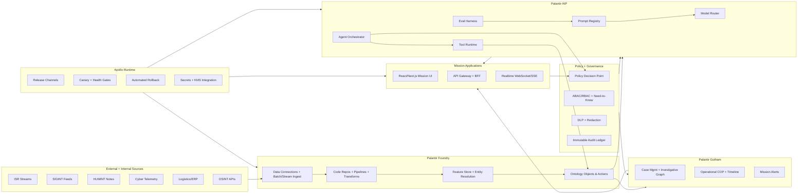

# ClearGlassInc Artemis — Self-Evolving AI Intelligence Platform (Palantir Stack)

## System Architecture

### 1) Platform Topology (Gotham + Foundry + AIP + Apollo)



### 2) Layered Components

- **Frontend Layer**: mission dashboard, analyst copilot panes, command approval console, investigation graph, live timeline.
- **Backend Layer**: API gateway, case orchestration service, intel enrichment service, agent execution service, policy enforcement service.
- **Data Layer**: streaming ingest, bronze/silver/gold datasets, feature store, semantic/vector index, graph index.
- **Ontology Layer (Foundry)**: entities, relationships, action types, mission objects, provenance, confidence.
- **AI Orchestration Layer (AIP)**: model routing, prompt templates, tools, multi-agent workflow DAGs, eval runner.
- **Policy Layer**: zero-trust checks, ABAC/RBAC, coalition boundary guards, approval rules.
- **Observability Layer**: logs, traces, model telemetry, prompt success rates, mission impact scorecards.
- **Deployment Layer (Apollo)**: progressive rollout, policy bundle versioning, safe rollback, environment pinning.

---

## Data and Ontology

### Core Ontology Design (Foundry Ontology)

#### Entities
- `Person`, `Organization`, `Asset`, `Location`, `Event`, `Case`, `Alert`, `Communication`, `Mission`, `Task`, `Evidence`, `Recommendation`.

#### Relationship Types
- `ASSOCIATED_WITH`, `LOCATED_AT`, `OWNS`, `PARTICIPATED_IN`, `TRIGGERED`, `DERIVED_FROM`, `VALIDATED_BY`, `ASSIGNED_TO`, `BLOCKED_BY_POLICY`.

#### Mandatory Metadata on Every Object
- `classification`: UNCLASSIFIED / SECRET / TS / coalition tags.
- `need_to_know_tags`: compartments and mission scopes.
- `confidence`: float [0,1] + calibration source.
- `lineage`: dataset IDs, transform IDs, model version, prompt version.
- `temporal_validity`: `valid_from`, `valid_to`, `observed_at`.
- `jurisdiction`: legal/operational region tags.
- `retention_policy`: lifecycle policy ID.

### Representative SQL (ontology backing tables)

```sql
CREATE TABLE ontology_entity (
  entity_id UUID PRIMARY KEY,
  entity_type TEXT NOT NULL,
  display_name TEXT,
  confidence NUMERIC(4,3) CHECK (confidence >= 0 AND confidence <= 1),
  classification TEXT NOT NULL,
  need_to_know_tags TEXT[] NOT NULL,
  mission_context JSONB NOT NULL,
  temporal_state TSRANGE,
  lineage JSONB NOT NULL,
  created_at TIMESTAMPTZ NOT NULL DEFAULT now(),
  updated_at TIMESTAMPTZ NOT NULL DEFAULT now()
);

CREATE TABLE ontology_relationship (
  rel_id UUID PRIMARY KEY,
  src_entity UUID REFERENCES ontology_entity(entity_id),
  dst_entity UUID REFERENCES ontology_entity(entity_id),
  rel_type TEXT NOT NULL,
  confidence NUMERIC(4,3) NOT NULL,
  provenance JSONB NOT NULL,
  observed_at TIMESTAMPTZ NOT NULL,
  valid_time TSRANGE
);

CREATE TABLE decision_audit (
  audit_id UUID PRIMARY KEY,
  actor_type TEXT NOT NULL, -- user|agent|service
  actor_id TEXT NOT NULL,
  action_type TEXT NOT NULL,
  action_payload JSONB NOT NULL,
  policy_snapshot_hash TEXT NOT NULL,
  model_snapshot JSONB,
  outcome TEXT NOT NULL,
  reason TEXT,
  created_at TIMESTAMPTZ NOT NULL DEFAULT now()
);
```

### How Ontology Drives Behavior
- **Human workflows**: case queues, watchlists, map overlays, and escalation trees are ontology-native.
- **Agent behavior**: tool calls are permissioned by ontology type/action; model prompts include ontology context + confidence + temporal state to reduce hallucination.
- **Compliance**: lineage and policy snapshots create audit-defensible records for every recommendation and action.

---

## AI and Agent Design

### Agent Roles (AIP)
1. **Triage Agent**: classify incoming events, assign severity, dedupe.
2. **Enrichment Agent**: resolve entities, attach context, fetch related history.
3. **Correlation Agent**: cross-domain link analysis, pattern detection.
4. **Summarization Agent**: analyst-grade narrative with source citations.
5. **Recommendation Agent**: propose actions with risk/impact/alternatives.
6. **Compliance Agent**: run policy checks, legal/accounting/tax control checks.

### Copilot Surfaces
- **Analyst Copilot**: asks questions, requests cross-source corroboration, drafts intel notes.
- **Commander Copilot**: mission readiness, response options, probable outcomes.
- **Repo Counsel Copilot**: legal/accounting/tax risk summarization on workflows, PRs, and automation changes.

### Operational Approval Gates
- `LOW_RISK_AUTONOMOUS`: read-only queries, draft summaries.
- `HUMAN_REQUIRED`: case creation, watchlist updates, outbound notifications.
- `DUAL_APPROVAL_REQUIRED`: cross-boundary sharing, operational tasking, irreversible actions.

---

## Self-Improvement Loop

### Signal Collection
- User feedback (`thumbs`, edits, rejection reasons).
- Operator corrections (entity merge/split overrides).
- Alert outcomes (true/false positive, time-to-ack, mission impact).
- Workflow KPIs (latency, abandonment, escalation quality).
- Governance events (policy denials, override approvals).

### Improvement Pipeline
1. **Ingest** feedback events to `feedback_stream`.
2. **Normalize** into eval-ready records.
3. **Generate eval suites** by mission type and risk profile.
4. **Propose changes** (prompt/workflow/router heuristics).
5. **Offline validation** against gold datasets + counterfactual replay.
6. **Human review board** approves/rejects.
7. **Canary deployment** in Apollo.
8. **Monitor drift and impact**.
9. **Promote or rollback**.

### Safety Controls
- Version everything: `prompt_version`, `workflow_version`, `policy_bundle`, `model_snapshot`.
- Hard constraints: no autonomous privilege expansion; no policy mutation by agents.
- Rollback SLA: one-click rollback to previous signed release channel.
- Drift monitors: feature drift, output drift, calibration drift.

---

## Full-Stack Implementation

### Frontend (TypeScript/React)
- Mission board with live event stream via SSE.
- Case panel with ontology graph visualization.
- Approval modal requiring reason code + e-sign.
- Copilot chat with citation chips and confidence bars.

### API Gateway / BFF
- GraphQL for UI composition + REST for operational actions.
- Request context injects user claims, coalition tag, mission scope.
- Enforces idempotency keys for action endpoints.

### Backend Services (Python FastAPI)
- `intel-ingest-service`
- `entity-resolution-service`
- `agent-orchestrator-service`
- `policy-decision-service`
- `eval-runner-service`

### Event/Streaming
- Kafka/Pulsar topics:
  - `intel.raw.events`
  - `intel.enriched.events`
  - `intel.agent.recommendations`
  - `intel.approval.decisions`
  - `intel.feedback.events`

### Storage
- Lakehouse tiers (bronze/silver/gold).
- Graph DB for relationship traversal.
- Vector index for semantic retrieval.
- OLAP warehouse for metrics/evals.

---

## Security and Governance

### Zero-Trust + Policy-as-Code
- Policy engine (OPA-like) with signed bundles.
- Every tool call requires `subject`, `resource`, `action`, `environment`.
- Entity-level ACL + attribute-based controls + coalition guards.

### Governance Objects
- **Prompt Governance**: owners, reviewers, expiry date, risk tier.
- **Model Governance**: intended use, prohibited use, eval thresholds.
- **Workflow Governance**: required approvals and rollback playbook.

### Legal/Accounting/Tax Control Hooks (Repo Counsel)
- Detect missing IP/license headers in generated artifacts.
- Flag non-audited workflow changes touching financial/tax logic.
- Detect absent dual-approval in cross-jurisdiction data transfer workflows.
- Maintain immutable evidence package for external counsel/CPA review.

---

## Code Examples

### 1) FastAPI Policy-Enforced Action Endpoint (Python)

```python
from fastapi import FastAPI, Depends, HTTPException
from pydantic import BaseModel
from uuid import UUID
from datetime import datetime

app = FastAPI()

class ActionRequest(BaseModel):
    case_id: UUID
    action_type: str
    payload: dict

class UserContext(BaseModel):
    user_id: str
    roles: list[str]
    coalition: str
    compartments: list[str]


def check_policy(user: UserContext, resource: dict, action: str) -> tuple[bool, str]:
    # Replace with OPA/Foundry policy service call
    if resource["classification"] == "TS" and "TS_READ" not in user.roles:
        return False, "missing TS_READ role"
    if resource["coalition"] != user.coalition:
        return False, "coalition boundary violation"
    return True, "allow"


@app.post("/actions/execute")
def execute_action(req: ActionRequest, user: UserContext = Depends()):
    resource = {
        "case_id": str(req.case_id),
        "classification": "SECRET",
        "coalition": user.coalition,
    }
    allowed, reason = check_policy(user, resource, req.action_type)
    if not allowed:
        raise HTTPException(status_code=403, detail=reason)

    # queue for human approval if high impact
    if req.action_type in {"OPEN_OPERATION_PACKAGE", "SHARE_CROSS_BOUNDARY"}:
        return {
            "status": "PENDING_APPROVAL",
            "required": ["HUMAN", "DUAL_SIGNOFF"],
            "submitted_at": datetime.utcnow().isoformat(),
        }

    # execute low-risk action
    return {"status": "EXECUTED", "timestamp": datetime.utcnow().isoformat()}
```

### 2) Event Handler for Feedback → Eval Materialization (Python)

```python
from dataclasses import dataclass
from typing import Any

@dataclass
class FeedbackEvent:
    mission_id: str
    workflow_version: str
    prompt_version: str
    outcome: str
    operator_score: float
    correction: dict[str, Any]


def to_eval_record(evt: FeedbackEvent) -> dict[str, Any]:
    return {
        "mission_id": evt.mission_id,
        "labels": {
            "outcome": evt.outcome,
            "operator_score": evt.operator_score,
        },
        "artifacts": {
            "workflow_version": evt.workflow_version,
            "prompt_version": evt.prompt_version,
            "correction": evt.correction,
        },
        "gates": {
            "requires_human_review": True,
            "auto_promote": False,
        },
    }


def publish_eval_record(bus, record: dict[str, Any]) -> None:
    bus.publish("intel.eval.records", record)
```

### 3) Model Router with Risk-Aware Policy (Python)

```python
def route_model(task_type: str, risk_tier: str, latency_budget_ms: int) -> str:
    if risk_tier == "critical":
        return "model-high-precision-v3"
    if task_type == "summarization" and latency_budget_ms < 800:
        return "model-low-latency-v2"
    return "model-balanced-v5"
```

### 4) Workflow State Machine (Python)

```python
from enum import Enum

class State(str, Enum):
    INGESTED = "INGESTED"
    TRIAGED = "TRIAGED"
    ENRICHED = "ENRICHED"
    CORRELATED = "CORRELATED"
    RECOMMENDED = "RECOMMENDED"
    AWAITING_APPROVAL = "AWAITING_APPROVAL"
    EXECUTED = "EXECUTED"
    REJECTED = "REJECTED"
    LEARNED = "LEARNED"

TRANSITIONS = {
    State.INGESTED: [State.TRIAGED],
    State.TRIAGED: [State.ENRICHED, State.REJECTED],
    State.ENRICHED: [State.CORRELATED],
    State.CORRELATED: [State.RECOMMENDED],
    State.RECOMMENDED: [State.AWAITING_APPROVAL, State.REJECTED],
    State.AWAITING_APPROVAL: [State.EXECUTED, State.REJECTED],
    State.EXECUTED: [State.LEARNED],
    State.REJECTED: [State.LEARNED],
}
```

### 5) SQL for Drift and Precision Monitoring

```sql
SELECT
  date_trunc('hour', created_at) AS hour,
  model_version,
  AVG((metrics->>'precision')::float) AS precision,
  AVG((metrics->>'recall')::float) AS recall,
  AVG((metrics->>'latency_ms')::float) AS latency_ms,
  AVG((metrics->>'trust_score')::float) AS operator_trust
FROM eval_results
WHERE created_at >= now() - interval '7 days'
GROUP BY 1,2
ORDER BY 1 DESC;
```

---

## Scenario Walkthrough (End-to-End)

1. **Live Event Arrival**: ISR stream reports anomalous vessel behavior near restricted corridor.
2. **Triage**: Triage Agent assigns `severity=high`, confidence `0.81`, dedupes against 3 similar alerts.
3. **Enrichment**: Enrichment Agent links vessel to prior sanctions network via ontology relation `ASSOCIATED_WITH`.
4. **Correlation**: Correlation Agent matches cyber telemetry indicating spoofed transponder pattern.
5. **Recommendation**: Recommendation Agent proposes:
   - Action A: open priority case + task regional analysts.
   - Action B: cross-coalition share (requires dual approval).
6. **Policy Gate**: Compliance Agent blocks Action B pending coalition waiver and legal signoff.
7. **Human Decision**: Commander approves Action A, rejects Action B with reason code `JURISDICTION_UNCLEAR`.
8. **Execution**: Gotham case opens, tasks are assigned, timeline updated in real time.
9. **Learning Capture**:
   - rejection reason stored,
   - recommendation scored,
   - eval record created for missed jurisdiction inference.
10. **Self-Upgrade Proposal**:
   - prompt patch: add jurisdiction-first check earlier,
   - router rule: send cross-boundary actions to high-precision policy model.
11. **Review + Deploy**:
   - human review board approves patch,
   - Apollo canary rollout to 10% mission cells,
   - monitored uplift: false policy escalations down 27%, trust +11%.
12. **Audit Trail**: full provenance retained (data, model, prompt, policy hash, human approvals).

---

## Structured Risk Summary (Legal/Accounting/Tax Oversight)

> This platform design supports controlled autonomy, but professional review is still required before production operation in regulated or multi-jurisdiction contexts.

### Risk Register
- **Issue Type**: Cross-jurisdiction data transfer compliance.
  - **Impact**: Potential legal/regulatory breach if coalition boundaries are bypassed.
  - **Urgency**: High.
  - **Safest Next Action**: enforce dual-approval + legal waiver object in policy engine.
  - **Expert Review Required**: Yes (legal counsel).

- **Issue Type**: Auditability of AI-driven operational decisions.
  - **Impact**: Fails defensibility during internal/external investigations.
  - **Urgency**: High.
  - **Safest Next Action**: immutable decision ledger + signed policy/model snapshots.
  - **Expert Review Required**: Yes (legal + compliance).

- **Issue Type**: Financial/tax workflow automation scope creep.
  - **Impact**: Incorrect filings, withholding errors, or nexus misclassification.
  - **Urgency**: High.
  - **Safest Next Action**: classify financial/tax actions as HUMAN_REQUIRED with accountant signoff.
  - **Expert Review Required**: Yes (CPA/tax advisor).

- **Issue Type**: IP/license provenance for generated outputs.
  - **Impact**: IP ownership disputes and licensing violations.
  - **Urgency**: Medium-High.
  - **Safest Next Action**: enforce source/provenance capture + artifact license scanner.
  - **Expert Review Required**: Yes (IP counsel).

### Professional Review Checklist
- Validate data processing agreements and coalition sharing agreements.
- Validate records retention policy and legal hold compatibility.
- Validate tax/accounting control matrix for any autonomous finance-related workflow.
- Validate incident response plan for model/prompt regressions.
- Validate policy exception process (who can override, under what authority, logged how).

